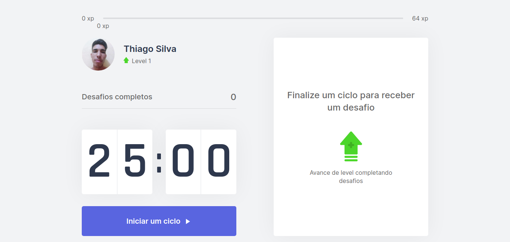
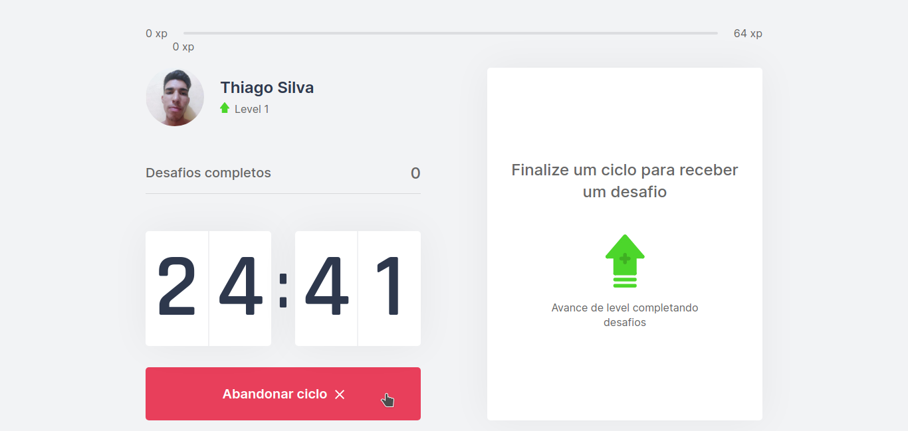
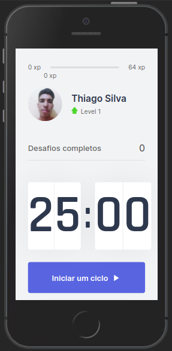

<p align="center">
  
</p>

<p align="center">
  <a href="https://github.com/csorlandi">
    
  </a>

  

  

  
</p>

<p align="center">
  
  
  </br>
  </br>
  
  <span></span>
  
</p>

# :pushpin: Tabela de conteúdos

* [Sobre o projeto](#satisfied-sobre-o-projeto)
* [Layout](#panda_face-layout)
* [Tecnologias](#snowflake-tecnologias)
* [Como rodar o projeto](#question-como-rodar-o-projeto)
* [Autor](#closed_book-autor)

---
# :satisfied: Sobre o projeto
O projeto Move.it, desenvolvido durante a quarta edição da NextLevelWeek by [Rocketseat](https://rocketseat.com.br/) na trilha React, consiste em ajudar as pessoas à controlar seu tempo na frente do PC para poder fazer pequenas pausas e assim, descansar a visão e o corpo.

---
# :panda_face: Layout
* [Figma](https://www.figma.com/file/W9GhJmXJNOZsvA7kcEqOlc/Move.it-1.0-Copy)
* [Figma (versão 2.0)](https://www.figma.com/file/DfJf2tpmWubSdBKgXcZarA/Move.it-2.0-(Copy))

---
# :snowflake: Tecnologias
* [TypeScript](https://www.typescriptlang.org/)
* [React](https://pt-br.reactjs.org/)
* [NextJs](https://nextjs.org/)

---
# :question: Como rodar o projeto
## Acessando direto pelo site:
* Você pode clicar nesse [link](http://move-it-th1ag0-zz.vercel.app/) e acessar a aplicação que está hospedada na plataforma da Vercel.

## Rodando na máquina local:
(certifique-se de ter instalado na sua máquina o [Node](https://nodejs.org/en/) e o [Yarn](https://yarnpkg.com/))
1. Abra o terminal na pasta desejada para clonar o repositório e execute o comando:
``` bash
git clone https://github.com/th1ag0-Zz/NLW-04-Move.it.git
```
2. Depois de concluído, execute os seguintes comandos para iniciar o server e será aberto no seu navegador uma aba com o projeto já rodando:
``` bash
cd NLW-04_Move.it/
```
Para instalar as dependencias:
``` bash
yarn
```
Inciando o server:
``` bash
yarn start
```
4. Por fim, abra a pasta clonada em seu editor de códigos favorito e faça as suas alterações! xD

---
# :closed_book: Autor
Feito por [Thiago Silva](https://github.com/th1ag0-Zz).
### :octocat: Github: https://github.com/th1ag0-Zz
### :link: LinkedIn: https://www.linkedin.com/in/thiago-furtado-silva/
### :camera: Instagram: https://www.instagram.com/thiag0_dev/
### :mailbox: Gmail: thiagof89.tf@gmail.com
### :rocket: Rocketseat: https://app.rocketseat.com.br/me/thiago-furtado-1575175681